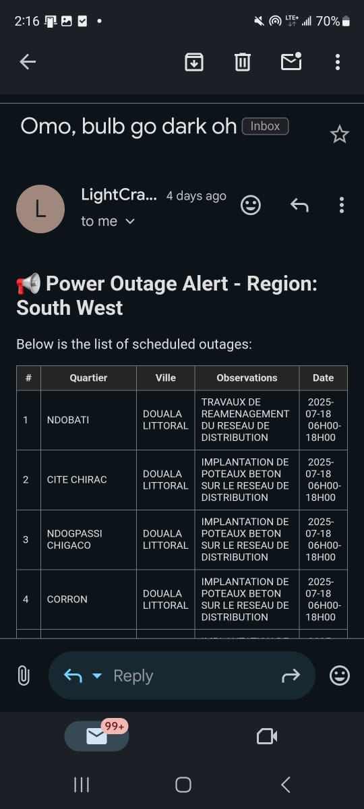

# 🔌 LightCrawler

**LightCrawler** is a Node.js script that scrapes power outage information from Eneo's alert system and emails the outage data to a specified recipient daily.

## 📦 Features

- 🕸 Scrapes outage data by selected region/town
- 📬 Sends daily emails when there is a planned outage with structured outage information of
- 🔄 Schedules scraping and emailing automatically

---

## 🚀 How It Works

1. Launches a headless browser using Puppeteer
2. Navigates to the Eneo iframe or outage page
3. Selects a specific region (e.g., `SouthWest`)
4. Extracts all listed outages (town, neighborhood, reason, date, time)
5. Sends a formatted HTML email to your inbox

---

## 🛠 Setup

### 1. Clone this repository

```bash
git clone https://github.com/yourusername/lightcrawler.git
cd lightcrawler
```

### 2. Install dependencies

```bash
npm install
```

### 3. Create a `.env` file in the root directory

```env
SMTP_USER=your_email@example.com
SMTP_PASS=your_email_password_or_app_pass
EMAIL_TO=recipient@example.com

```

> Use an **App Password** if using Gmail or other services with 2FA.

---

## 📧 Sending Email

The script uses [nodemailer](https://nodemailer.com/about/) with an SMTP provider to send structured outage reports.

Example output:

```html
<b>Outage in ETOUG EBE</b><br />
City: YAOUNDE CENTRE<br />
Reason: Nettoyage des lignes du réseau de distribution<br />
Date: 2025-07-18<br />
Time: 07H00–17H00
```

---

## 📧 Sample Output



---

## 🧪 Run Manually

```bash
node index.mjs
```

---
